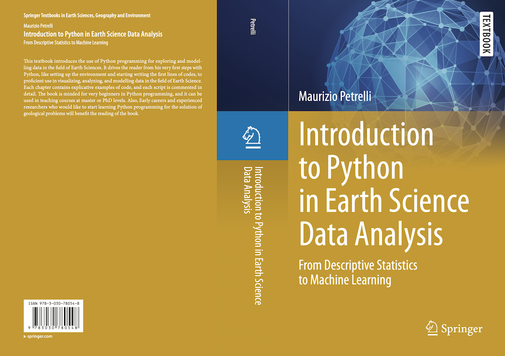

## Introduction to Python in Earth Science Data Analysis
Follow Me on Twitter: 

### Scope of the Repository

This is the code repository for the book titled "Introduction to Python in Earth Science Data Analysis: From Descriptive Statistics to Machine Learning" by Maurizio Petrelli, to be published by Springer

## Codes
###  Table of Contents:

* Chapter 1: Setting Up Your Python Environment, Easily

* [Chapter 2: Python Essentials for a Geologist](https://github.com/petrelli-m/python_earth_science_book/tree/main/code/chapter_02)
* [Chapter 3: Solving Geology Problems Using Python: An Introduction](https://github.com/petrelli-m/python_earth_science_book/tree/main/code/chapter_03)
* [Chapter 4: Graphical Visualization of a Geological Data Set](https://github.com/petrelli-m/python_earth_science_book/tree/main/code/chapter_04)
* [Chapter 5: Descriptive Statistics 1: Univariate Analysis](https://github.com/petrelli-m/python_earth_science_book/tree/main/code/chapter_05)
* [Chapter 6: Descriptive Statistics 2: Bivariate Analysis](https://github.com/petrelli-m/python_earth_science_book/tree/main/code/chapter_06)
* [Chapter 7: Numerical Integration](https://github.com/petrelli-m/python_earth_science_book/tree/main/code/chapter_07)
* [Chapter 8: Differential Equations](https://github.com/petrelli-m/python_earth_science_book/tree/main/code/chapter_08)
* [Chapter 9: Probability Density Functions and Their Use in Geology](https://github.com/petrelli-m/python_earth_science_book/tree/main/code/chapter_09)
* [Chapter 10: Error Analysis](https://github.com/petrelli-m/python_earth_science_book/tree/main/code/chapter_10)
* [Chapter 11: Introduction to Robust Statistics](https://github.com/petrelli-m/python_earth_science_book/tree/main/code/chapter_11)
* [Chapter 12:  Machine Learning](https://github.com/petrelli-m/python_earth_science_book/tree/main/code/chapter_11)

## Jupyter Notebooks
* [Chapter 4: Prepare a publication-ready diagram](https://nbviewer.jupyter.org/github/petrelli-m/python_earth_science_book/blob/a157fbe9e2df70bf62e840ae801762f310dec372/Jupyter_Notebooks/chapter_4/publication_ready_diagram.ipynb)
* [Chapter 6:  Crystal-lattice-strain mode](https://nbviewer.jupyter.org/github/petrelli-m/python_earth_science_book/blob/1300b44b62e77ae3dd63128634617b56766709f2/Jupyter_Notebooks/chapter_6/cryst_latt_strain_model.ipynb)
* [Chapter 7: Computing the Lithostatic Pressure](https://nbviewer.jupyter.org/github/petrelli-m/python_earth_science_book/blob/1300b44b62e77ae3dd63128634617b56766709f2/Jupyter_Notebooks/chapter_7/lithostatic_pressure.ipynb)
* [Appendix A: Python Packages and Resources for Geologists](https://nbviewer.jupyter.org/github/petrelli-m/python_earth_science_book/blob/f93f341d2c9f7bcacd891e9eb5e3bf75b3daa397/Jupyter_Notebooks/appendix_a/resources_for_geologists.ipynb)

### License

The code in this repository is released under the [MIT license](LICENSE). Read more about [MIT license](https://opensource.org/licenses/MIT).

### Cover

